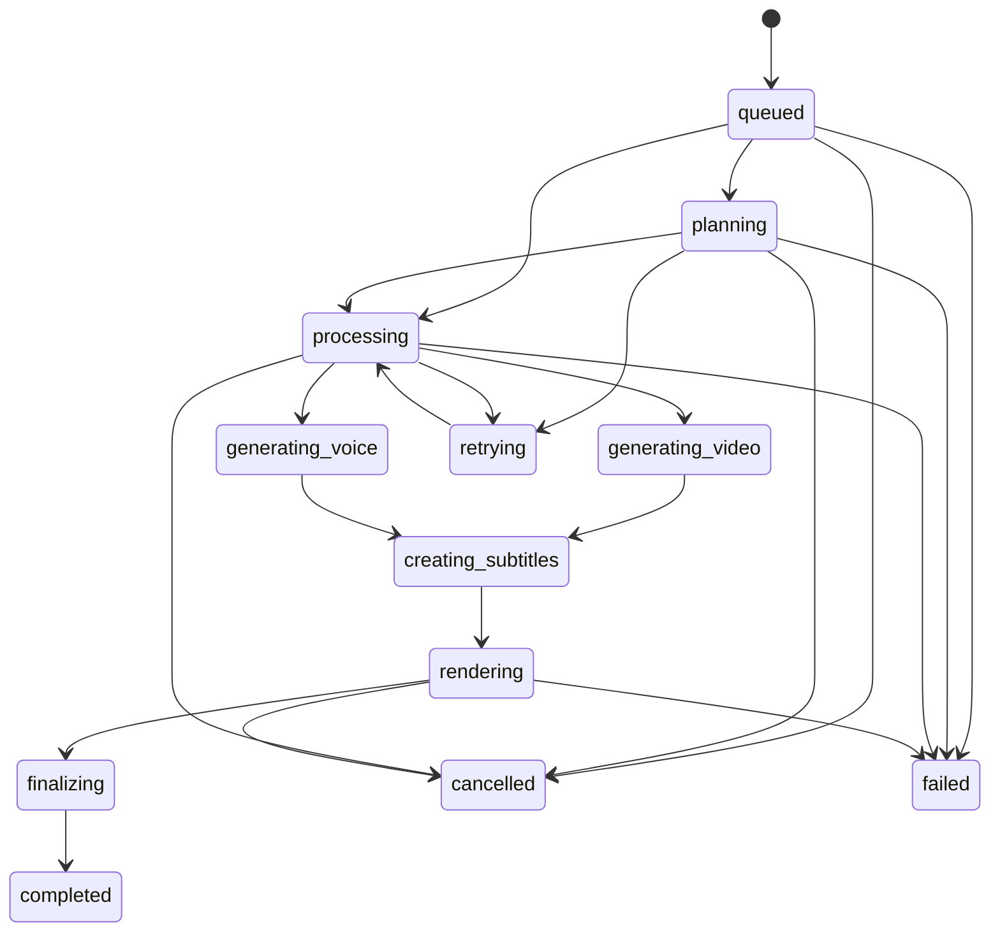
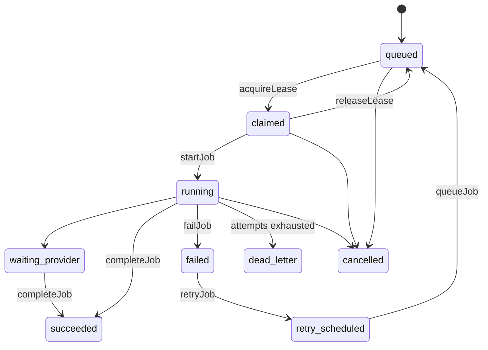

# Milestone 2.2A — Durable Job Lifecycle Foundation

## Purpose

This milestone establishes the server-only application services that own durable `Generation` and `GenerationJob` lifecycle changes. It implements persistence rules only: no queue, worker, polling loop, provider execution, or frontend behavior changes are introduced.

The design is the first implementation layer beneath Backend Architecture v2. AI Brain inputs, decisions, versions, and quality summaries remain immutable-or-append-only generation metadata rather than provider-specific lifecycle logic.

## Service boundary

- `GenerationService` owns generation creation, loading, progress, state transitions, cancellation, failure, completion, and metadata append operations.
- `GenerationJobService` owns job creation, loading, queueing, leases, attempt starts, progress, completion, failure, cancellation, and explicit retry scheduling.
- Repositories are the only new lifecycle modules that issue Prisma queries.
- All reads and writes require the authenticated internal `userId`; project, generation, dependency, job, and media lookups are owner-scoped.
- Optimistic `version` predicates reject concurrent lifecycle writes instead of silently overwriting them.

API routes and future workers must call these services. They must not write lifecycle fields directly.

## Generation lifecycle

Video, voice, subtitle, and revision work may be parallel, so active aggregate states may move between active states. `completed`, `failed`, and `cancelled` are terminal. Explicit validation rejects terminal-to-active transitions and any transition absent from the state table.

Progress is an integer from 0 through 100 and is monotonic. Completion sets stage `completed` and progress `100`.

## Job lifecycle

`succeeded`, `dead_letter`, and `cancelled` are terminal. `failed` may transition only to `retry_scheduled` after retry validation; it cannot jump directly back to `queued`.

## Lease model

- A lease can be acquired only for a queued job or reclaimed from an expired claimed job.
- Acquisition is one atomic conditional database update.
- The caller supplies a non-empty worker identity and a duration from 1 second through 15 minutes.
- Starting, completing, or failing leased work validates both owner and expiry.
- A claimed job may release its valid lease back to `queued`.
- Completion, failure, and cancellation clear lease fields.
- Heartbeat storage exists, but periodic heartbeat execution is deferred.

Lease expiry makes abandoned claims reclaimable. It does not itself execute or requeue work.

## Retry model

- `attemptCount` increments when a leased job starts.
- `maxAttempts` includes the initial attempt; derived maximum retries are `maxAttempts - 1`.
- Retryable failures require `nextRetryAt`.
- `retryJob` validates retryability, remaining attempts, and elapsed delay, then records `retry_scheduled`.
- `queueJob` is a separate explicit step.
- Exhausted retryable failures become `dead_letter`.

No retry is dispatched automatically in this milestone.

## Cancellation and failure

Cancellation records a sanitized reason and cancellation timestamp. Generation cancellation also records the first request timestamp. Cancellation changes durable state but does not interrupt external execution.

Failure recording is centralized. It stores:

- normalized category and optional code in the existing failure-code field;
- a bounded, redacted message;
- an allowlisted provider-detail object and retryability in versioned lifecycle metadata;
- the existing failure timestamp.

Raw provider bodies, credentials, URLs, filesystem paths, SDK errors, and request identifiers are not accepted as structured provider details.

Cancellation reasons use the same existing versioned metadata boundary. No schema migration is required beyond Milestone 2.1.

## Repository layout

- `lib/repositories/generation-repository.ts`
- `lib/repositories/generation-job-repository.ts`
- `lib/repositories/media-asset-repository.ts`
- `lib/services/generation-service.ts`
- `lib/services/generation-job-service.ts`
- `lib/domain/generation-lifecycle.ts`

Repositories provide owner-scoped reads, optimistic writes, idempotent lookup support, dependency validation, and atomic lease acquisition. `MediaAssetRepository` establishes the same owned persistence boundary for the later media cutover.

## Synchronous compatibility

The current browser-driven pipeline remains synchronous. `lib/storage/generations.ts` is the isolated compatibility adapter:

- its existing save response remains unchanged;
- synchronous completed generations retain `legacy` execution mode;
- creation and status changes delegate to `GenerationService`;
- an authenticated internal owner is now mandatory, matching the protected API route;
- no Studio, loading, provider, render, or project UI flow is changed.

The adapter is temporary. Backend Architecture v2 will replace it when the generation-start API and workers become authoritative.

## Transaction and concurrency rules

Each lifecycle mutation is a single atomic database operation guarded by owner and version. Lease acquisition adds eligibility and expiry predicates to the same write. Multi-entity orchestration is intentionally absent; when 2.2B introduces operations that update a generation and jobs together, the service coordinator must use one Prisma transaction and repository instances bound to that transaction.

## Deferred to 2.2B

- queue transport, workers, and dispatch
- dependency resolution
- heartbeat loops and abandoned-running-job recovery
- provider submission and reconciliation
- automatic retry scheduling
- generation/job polling APIs
- cancellation propagation and provider interruption
- job-attempt history and operational telemetry
- media-asset persistence cutover
- frontend progress and cancellation controls
